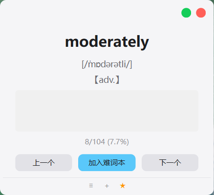
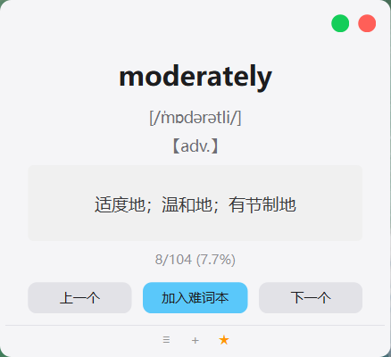

# PEEK｜桌面生词复习工具

PEEK是一款面向电脑学习场景的轻量桌面生词复习工具。它适合已经维护个人生词表、希望在阅读文献或切换任务的间隙快速复习少量单词的用户。

| 默认隐藏释义 | 悬停显示释义 |
|---|---|
|  |  |

## 为什么做这个工具

我在准备英语考试和阅读英文资料时已经积累了一份个人生词表，但纸质词表不方便随时查看，手机背词又容易打断电脑上的学习任务。因此，我尝试把个人词表放进一个常驻桌面的悬浮窗口：需要时快速看几个单词，不需要时继续原来的工作。

这个项目首先解决的是我自己的具体问题，并不代表所有背词用户都存在相同需求。

## 核心功能

- 导入CSV、TXT或DOCX格式的个人词表；
- 默认隐藏释义，鼠标悬停后查看答案；
- 浏览上一个或下一个单词；
- 将不熟悉的单词加入难词本并单独复习；
- 保存当前复习进度、难词本和上次导入路径。

## 核心交互

1. 导入个人词表；
2. 先看单词并尝试回忆；
3. 鼠标移入释义区域查看答案；
4. 根据掌握情况加入难词本或切换到下一个单词；
5. 后续进入难词本继续复习。

## 运行方式

当前版本主要面向Windows桌面环境。

```bash
pip install -r requirements.txt
python word_tool.py
```

如需导入示例数据，可选择仓库中的 `sample_words.csv`。

### 词表格式

每行依次填写：

```text
word,phonetic,part_of_speech,meaning
```

当前解析逻辑不要求表头，含逗号的释义建议使用英文双引号包裹。

## 用户验证与反思

我曾邀请7位同学体验这个工具。测试后发现，CSV导入的操作成本只是表面问题，更深层的限制是多数同学并没有长期维护个人生词表的习惯。因此，PEEK更适合“已有个人词表＋长期使用电脑学习”的小众用户，而不是通用背词产品。

这次经历让我认识到：个人痛点可以成为产品起点，但不能直接代表普遍需求；做出MVP后仍然需要通过真实使用判断目标用户是否成立。

## 我在项目中的工作

- 从自己的电脑学习场景出发，定义目标用户、核心问题和MVP功能；
- 设计隐藏释义、难词标记、循环复习和快捷操作等核心交互；
- 通过反复试用提出修改要求，并检查功能是否符合预期；
- 邀请7位同学体验，根据反馈重新判断目标人群和迭代方向。

开发过程中，我主要通过与DeepSeek多轮协作完成代码生成和调整。这个项目重点展示的是我将需求转化为可运行MVP并持续验证的过程，而不是个人独立编写全部代码。PEEK本身是一款AI辅助开发的桌面工具，不是以大模型能力为核心的AI产品。

## 验证结论与下一步

- 当前更适合“已有个人生词表＋长期使用电脑学习”的小众用户，不应定位成通用背词产品；
- 首次导入仍是主要使用门槛，下一步可以增加标准模板、格式检查和更清楚的导入反馈；
- 屏幕边缘自动收起与唤出更符合真实使用场景，但当前版本尚未实现；
- 在扩展公共词库或学习计划前，应先继续验证目标用户是否会持续使用。
